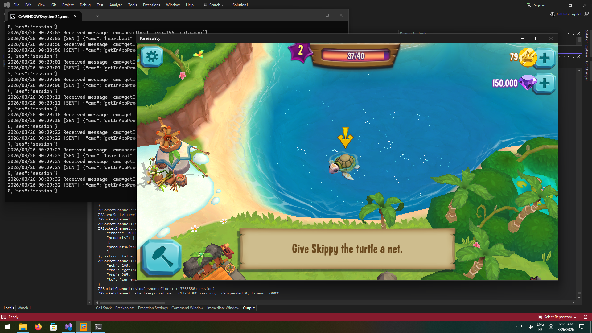

# Paradise Bay server

In 2015, King/Z2 made the "Paradise Bay" game which they discontinued in 2018, with servers closing. At the time I was playing this game. I wanted to re-play it but couldn't as the servers closed.

Fortunately, the servers URLs are just in an array in the `game-info.json` file, which is stored in the Appx package (on Windows).

The game running on Windows 11 25H2 and being debugged on Visual Studio 2022.

## Known issues

- Some things may not work, not all features have been re-implemented
- Remote assets (assets that were on King servers) cannot be re-added since the original servers don't exist anymore

## Usage with the game

### Downloading the game `.appx`

A `.appx` file is a Microsoft Store package file. Downloading it will allow us to edit its contents.

1. Go to https://store.rg-adguard.net/
2. Filter by ProductId, search for `9nblggh5l706`
3. Download `king.com.ParadiseBay_3.9.0.0_x86__kgqvnymyfvs32.appx` (the last file) and move it in this folder.

### Installing the game

1. Enable "Developer Mode": Go to Settings > System > For developers > Enable "Developer Mode"
2. Run `install.bat`

If you have any issues while installing or playing the game don't hesitate to [open a GitHub issue](https://github.com/CuteTenshii/paradise-bay-server/issues/new)!!

### Starting the server

You need to install [Go](https://go.dev/dl/) to run it. Then, run `start.bat`.